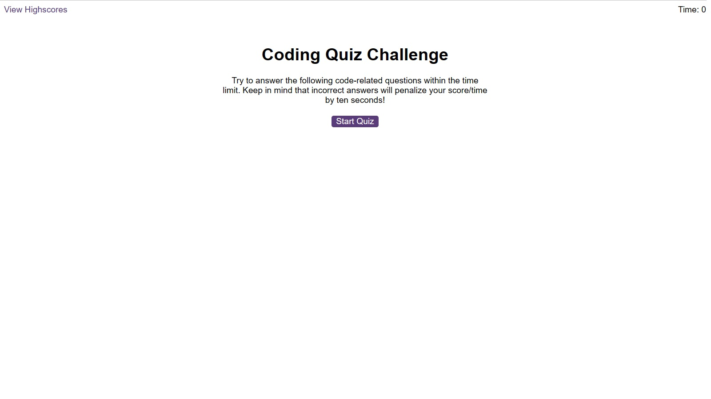
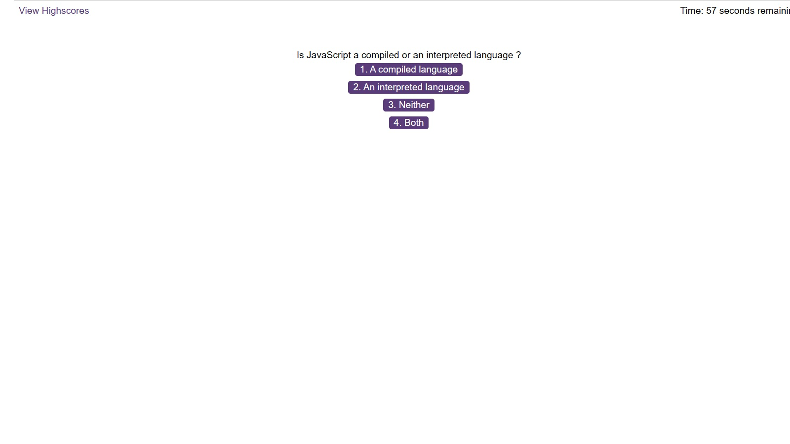
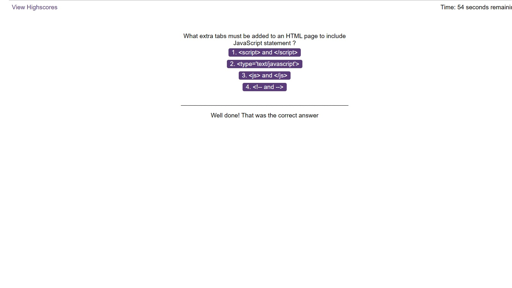
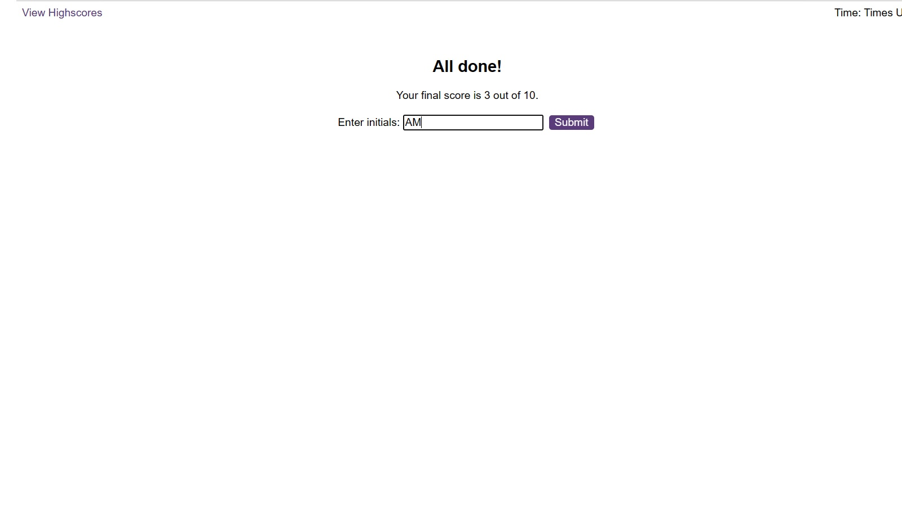

# FrontEndQuiz
This project is about the creation of a quiz game. The game displays a question about front-end coding and displays four possible answers. The user selects and answer which results in feedback on their choice and the game moves onto the next question. The game ends when the player runs out of time or has finished answering all the questions. A fun feature is that the player incurs a 10 second penalty for each incorrect answer.The user starts the process by clicking on the "start quiz" button as shown below:

## Questions
Once the start button is clicked. The first question is displayed and the player can select from the four options. The image below shows the question being displayed and the timer in action.

## Feedback
Following each selection the player will receive feedback. They will either get a message praising them for getting the answer right or being told that their answer was incorrect together with the correct answer being displayed. If the answer was incorrect the timer will lose 10 seconds from the time. The image below provides the details.

## Game Completion
Once the game is completed the player will get the total score and the option to record their initials and score on the highest score ladder. The game will end either the player runs out of time or once all the questions are answered. The image below displays the results screen.

## Application
Click the link below to view the application.
https://amoham1811.github.io/FrontEndQuiz/
